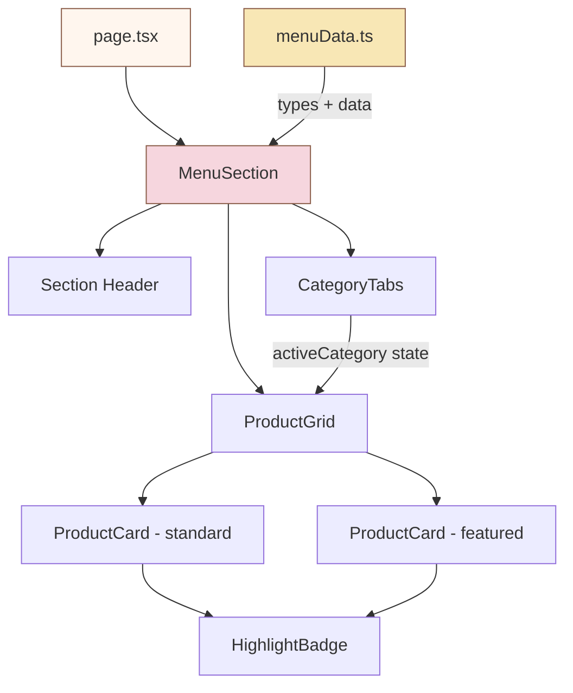

# Design Document: Menu Section

## Overview

The Menu Section replaces the existing `MenuPreview` component with a full-catalog browsing experience for the Maison Délice pastry website. The current component shows 3 hardcoded French-style categories with 12 items total. The new section expands this to 7 categories with 37 products, adds interactive category filtering via an accessible tablist, introduces featured product treatment and highlight labels, and formats prices in Peruvian soles.

The design preserves the existing visual language — soft rounded cards, Playfair Display headings, Poppins body text, the warm pastel palette, and Framer Motion animations with the site's signature `[0.22, 1, 0.36, 1]` easing curve. The component remains a client component (`"use client"`) since it uses Framer Motion and interactive state.

### Key Design Decisions

1. **Single file for the main component** — `MenuPreview.tsx` is replaced in-place to avoid changing `page.tsx` imports. The component name changes to `MenuSection` but the file stays at `src/components/MenuPreview.tsx` (or is renamed via the task).
2. **Separate data file** — All product data and TypeScript types live in `src/data/menuData.ts`, keeping the component focused on rendering.
3. **Client-side filtering with `useState`** — Category filtering is purely client-side since all 37 items are static data. No server calls needed.
4. **AnimatePresence for category transitions** — Framer Motion's `AnimatePresence` with `mode="wait"` handles exit/enter animations when switching categories, keeping transitions under 500ms.
5. **No images for product cards** — Unlike `SignatureDesserts`, the menu uses a text-based card layout (name, description, price, badge) consistent with traditional menu presentation. Featured products get a larger card with accent border, not an image.

## Architecture



The architecture is intentionally flat — a single `MenuSection` component that renders sub-elements inline (header, tabs, grid, cards). No separate component files are needed since the sub-elements are tightly coupled to the menu context and not reused elsewhere. This matches the pattern used by `SignatureDesserts`, `Gallery`, and other existing components.

### State Management

- **`activeCategory: string`** — Tracks the currently selected category slug. Defaults to `"tortas-enteras"`.
- State is local to `MenuSection` via `useState`. No global state or context needed.

### Data Flow

```
menuData.ts (static array + types)
       ↓
MenuSection (imports data, filters by activeCategory)
       ↓
ProductCard rendering (maps filtered items)
```

## Components and Interfaces

### MenuSection (replaces MenuPreview)

The root component. Renders the section header, category tabs, and product grid.

```typescript
// src/components/MenuPreview.tsx (file renamed or replaced)
"use client";

interface MenuSectionProps {}

export default function MenuSection(): JSX.Element
```

**Responsibilities:**
- Imports `categories` and `menuItems` from `menuData.ts`
- Manages `activeCategory` state
- Filters `menuItems` by active category
- Renders section with `id="menu"` anchor
- Wraps product grid in `AnimatePresence` for category transitions
- Applies staggered entrance animations to product cards

### CategoryTabs (inline within MenuSection)

Rendered as a `<div role="tablist">` containing buttons.

```typescript
// Inline — not a separate component
<div role="tablist" aria-label="Categorías del menú" className="...">
  {categories.map((cat) => (
    <button
      key={cat.slug}
      role="tab"
      aria-selected={activeCategory === cat.slug}
      aria-controls={`tabpanel-${cat.slug}`}
      tabIndex={activeCategory === cat.slug ? 0 : -1}
      onClick={() => setActiveCategory(cat.slug)}
      className="..."
    >
      {cat.name}
    </button>
  ))}
</div>
```

**Keyboard navigation:** Arrow keys move between tabs, Enter/Space activates. The active tab receives `tabIndex={0}`, inactive tabs get `tabIndex={-1}`. This follows the WAI-ARIA Tabs pattern.

**Mobile behavior:** The tablist container uses `overflow-x-auto` with `scrollbar-hide` utility and horizontal padding to allow swipe scrolling without layout overflow.

### ProductCard (inline within MenuSection)

Each product renders as an `<article>` element within the grid.

```typescript
// Standard card
<article className="bg-white rounded-2xl p-6 shadow-sm hover:shadow-md transition-all duration-300">
  <div className="flex justify-between items-start gap-4">
    <div>
      {highlightLabel && <HighlightBadge label={highlightLabel} />}
      <h3 className="font-heading text-lg font-semibold text-primary">{name}</h3>
      <p className="text-sm text-muted font-body font-light mt-1">{description}</p>
    </div>
    <span className="font-body font-semibold text-primary whitespace-nowrap">
      S/ {price}
    </span>
  </div>
</article>

// Featured card — same structure but with accent left border and slightly larger
<article className="bg-white rounded-2xl p-6 shadow-sm hover:shadow-md transition-all duration-300
  border-l-4 border-accent md:col-span-2">
  ...
</article>
```

### HighlightBadge (inline within ProductCard)

A small pill badge rendered above the product name when a highlight label exists.

```typescript
<span className="inline-flex items-center gap-1 px-2.5 py-0.5 rounded-full text-[10px] font-body font-medium bg-delicate/50 text-primary mb-2">
  {icon} {label}
</span>
```

**Label-to-color mapping:**
| Label | Background | Icon |
|---|---|---|
| Best seller | `bg-delicate/50` | ⭐ (Star from lucide) |
| Edición limitada | `bg-card/50` | ✦ (Sparkles from lucide) |
| Chef's creation | `bg-warm/50` | 👨‍🍳 (ChefHat from lucide) |
| Favorito | `bg-accent/15` | ❤ (Heart from lucide) |
| Ideal para regalo | `bg-card/50` | 🎁 (Gift from lucide) |

## Data Models

### TypeScript Types (`src/data/menuData.ts`)

```typescript
export type HighlightLabel =
  | "Best seller"
  | "Edición limitada"
  | "Chef's creation"
  | "Favorito"
  | "Ideal para regalo";

export interface MenuItem {
  name: string;
  description: string;
  price: number;           // Numeric value in soles (e.g., 118)
  category: string;        // Slug matching Category.slug
  highlightLabel?: HighlightLabel;
  featured?: boolean;
}

export interface Category {
  slug: string;
  name: string;
}
```

### Categories

```typescript
export const categories: Category[] = [
  { slug: "tortas-enteras", name: "Tortas enteras" },
  { slug: "porciones-individuales", name: "Porciones individuales" },
  { slug: "postres-de-vitrina", name: "Postres de vitrina" },
  { slug: "box-regalos-dulces", name: "Box / regalos dulces" },
  { slug: "bebidas-calientes", name: "Bebidas calientes" },
  { slug: "bebidas-frias", name: "Bebidas frías" },
  { slug: "especiales-de-temporada", name: "Especiales de temporada" },
];
```

### Data Shape Example

```typescript
export const menuItems: MenuItem[] = [
  {
    name: "Torta de frutos rojos y vainilla",
    description: "Bizcocho de vainilla, crema diplomática, frutos rojos frescos y glaseado espejo rosado.",
    price: 118,
    category: "tortas-enteras",
    highlightLabel: "Best seller",
    featured: true,
  },
  // ... 36 more items
];
```

### Price Formatting

Prices are stored as integers (soles). Display formatting is a pure function:

```typescript
export function formatPrice(price: number): string {
  return `S/ ${price}`;
}
```

This keeps the data layer clean (numeric prices for potential sorting/filtering) while the presentation layer handles the `S/` prefix.

### Data Validation Invariants

- Every `MenuItem.category` must match exactly one `Category.slug`
- `menuItems` must contain items for all 7 categories
- `price` must be a positive integer
- `highlightLabel`, if present, must be one of the 5 defined values
- Featured products: "Torta de frutos rojos y vainilla", "Torta de chocolate belga", "Cheesecake de maracuyá", "Box de 6 macarons", "Croissant relleno de pistacho", "Sweet Box Clásica"

## Correctness Properties

*A property is a characteristic or behavior that should hold true across all valid executions of a system — essentially, a formal statement about what the system should do. Properties serve as the bridge between human-readable specifications and machine-verifiable correctness guarantees.*

### Property 1: Category filter returns only matching items

*For any* set of menu items with arbitrary category assignments and *for any* selected category slug, filtering the items by that category SHALL return only items whose `category` field equals the selected slug, and SHALL return all such items (no items of that category are omitted).

**Validates: Requirements 2.2**

### Property 2: Price formatting round-trip

*For any* positive integer price value, `formatPrice(price)` SHALL produce a string matching the pattern `"S/ {n}"` where `{n}` is the decimal representation of the input, and parsing the numeric portion back SHALL yield the original value.

**Validates: Requirements 3.3, 6.3**

## Error Handling

This feature operates entirely on static client-side data with no network requests, so error scenarios are minimal:

| Scenario | Handling |
|---|---|
| Empty category (no items match filter) | Render an empty grid with no cards. The tabs remain interactive. This shouldn't occur with the shipped data but guards against future data edits. |
| Missing `highlightLabel` | Conditional render — badge is simply not rendered. No error. |
| Missing `featured` flag | Defaults to `false` (standard card treatment). |
| Invalid category slug in state | Falls through to empty filter result. Tabs always reset to a valid slug on click. |
| JavaScript disabled | The section renders with the default category visible (SSR initial state). Tabs won't be interactive, but the first category's products are visible as static HTML. |

No try/catch blocks or error boundaries are needed since there are no async operations or external data fetches.

## Testing Strategy

### Unit Tests (Example-Based)

Unit tests cover specific, concrete scenarios:

1. **Data integrity tests** (`menuData.test.ts`)
   - Verify `categories` has exactly 7 entries with expected slugs
   - Verify `menuItems` has 37 total items
   - Verify item counts per category: tortas-enteras=5, porciones-individuales=5, postres-de-vitrina=7, box-regalos-dulces=4, bebidas-calientes=7, bebidas-frias=5, especiales-de-temporada=4
   - Verify all `highlightLabel` values are from the allowed union type
   - Verify the 6 named featured products have `featured: true`
   - Verify every `MenuItem.category` matches a valid `Category.slug`
   - Verify all prices are positive integers

2. **Component rendering tests** (`MenuSection.test.tsx`)
   - Renders with `id="menu"` anchor
   - Renders the introductory header text
   - Renders 7 category tabs with correct names
   - First category is selected by default (aria-selected="true")
   - Clicking a tab changes the displayed products
   - Products with highlight labels show badge; products without don't
   - Featured products render with distinct styling (border-l-4 class)
   - ARIA roles: tablist, tab, tabpanel are present
   - Keyboard: Enter/Space on a tab activates it

### Property-Based Tests

Property-based tests use `fast-check` to verify universal properties across generated inputs. Each test runs a minimum of 100 iterations.

1. **Property 1: Category filter returns only matching items**
   - Generate random arrays of `MenuItem` objects with random category assignments from a pool of slugs
   - Pick a random category slug
   - Filter items by that slug
   - Assert: every returned item has `category === selectedSlug`
   - Assert: the count of returned items equals the count of items with that category in the original array
   - Tag: `Feature: menu-section, Property 1: Category filter returns only matching items`

2. **Property 2: Price formatting round-trip**
   - Generate random positive integers (1 to 100,000)
   - Call `formatPrice(n)`
   - Assert: result matches `/^S\/ \d+$/`
   - Assert: `parseInt(result.replace("S/ ", ""), 10) === n`
   - Tag: `Feature: menu-section, Property 2: Price formatting round-trip`

### Testing Library

- **fast-check** for property-based testing (widely used with TypeScript/Jest/Vitest)
- **React Testing Library** + **Jest** (or Vitest) for component tests
- Minimum 100 iterations per property test

### What Is NOT Tested

- CSS visual appearance (colors, fonts, rounded corners) — these are design review concerns
- Framer Motion animation timing and easing — declarative config, tested by the library itself
- Responsive breakpoint behavior — requires visual/E2E testing tools
- Scroll behavior of the category tabs on mobile — requires real browser testing
